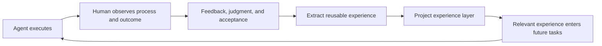

# Agent Navigator

[简体中文](README.md) | English

> **Let human experience continuously inform agent execution.**

Agent Navigator is a local, file-driven project experience layer that can be read by multiple agents.

It turns the observations, feedback, judgment, and methods that people develop through long-term human-agent collaboration into searchable, reviewable, and version-controlled Markdown. Agents such as Codex, Claude Code, and Kiro can then use that experience in relevant future tasks.

Agent Navigator is not a new agent runtime, nor does it replace the coding agent you already use. It establishes a shared experience interface inside a project, while the active agent continues to perform the actual work.

[Quick Start](#quick-start) · [Use It in a Real Project](#use-it-in-a-real-project) · [Confirm Adoption](#how-to-confirm-that-the-agent-has-adopted-it) · [How It Works](#how-it-works) · [Command Reference](#command-reference) · [Further Reading](#further-reading)

---

## Why Is It Needed?

The success of a long-running project does not depend on model capability alone. People continue to perform essential work when collaborating with agents:

- observing how an agent interprets a task and which action path it chooses;
- judging whether the result actually meets the project goal;
- identifying omissions, errors, boundaries, and risks;
- recognizing effective methods and gradually forming acceptance criteria;
- accumulating experience that only emerges through real project work.

This experience is a project asset, yet it often remains in people's heads, chat histories, or the private memory of a specific tool, making it difficult to carry forward into later execution.

Agent Navigator establishes the following loop:



Reducing repeated corrections can be one result of this loop, but it is not the project's fundamental definition. The deeper goal is:

> **Turn human experience from one-off implicit judgment into a project asset that can continue to help agents execute.**

---

## Core Idea: Start Like `git init`

You can think of `agent-navi init` as an initialization step similar to `git init`.

```text
git init
  → creates Git repository structures in a working directory
  → the Git workflow handles subsequent version management

agent-navi init
  → creates an experience layer and agent entry points in a working directory
  → Codex, Kiro, or another agent handles subsequent retrieval, execution, and maintenance
```

This analogy describes how the tool is used; it does not imply that the two tools have the same internal implementation.

`agent-navi init` does not start a resident service or perform project tasks for you. The command exits after leaving agent-readable project files behind. You then continue using Codex, Claude Code, Kiro, or another agent as usual.

| Participant | Primary responsibilities |
|---|---|
| CLI | Initialize directories, generate entry points, synchronize files, and provide deterministic maintenance tools |
| Agent | Understand the current task, retrieve relevant experience, do the work, and decide whether to maintain the experience layer |
| Human | Observe execution, evaluate outcomes, provide feedback, and confirm project goals and boundaries |

---

## Quick Start

### 1. Install

The current version requires Python 3.10 or later and has no third-party runtime dependencies.

Install after cloning the repository:

```bash
python3 -m pip install --user .
agent-navi --help
```

Use an editable installation if you plan to modify the source code:

```bash
python3 -m pip install --user -e .
```

After installation, any of the following entry points can be used:

```bash
agent-navi --help
agent-navigator --help
python3 -m agent_navigator --help
```

### 2. Initialize It in a Project Working Directory

Enter the root of a new or existing project:

```bash
cd /path/to/your-project
agent-navi init --target .
```

You can also specify the target directory from another location:

```bash
agent-navi init --target /path/to/your-project
```

Initialization creates the project experience layer:

```text
.agent-policy/
  current.md
  lessons.md
  heuristics.md
  playbooks.md
  inbox.md
  imports/
    raw/
```

It also generates or synchronizes entry points for different agents:

```text
AGENTS.md
CLAUDE.md
.kiro/steering/agent-policy.md
```

These entry points tell agents where the experience files live, how to select relevant experience, how the layers are prioritized, and when the experience layer is worth maintaining.

### 3. Open the Same Project with an Agent

Make sure the working directory used by Codex, Claude Code, Kiro, or another agent is the project root you just initialized, then submit tasks as usual.

At this point, the CLI has completed its main initialization work. You do not need to rerun `agent-navi init` for every task, and no Agent Navigator process needs to remain running.

---

## Use It in a Real Project

Initializing the files is only the first step. Agent Navigator creates value when these files are read, applied, and maintained during real work.

### First Use

Start an agent session in the target project root and give it a real task. For example:

```text
Review the code changes in this project. State the review scope, key findings,
and validation results.
```

If the active agent automatically discovers `AGENTS.md` or the corresponding tool-specific entry point, it should read that entry point first and then retrieve relevant experience from `.agent-policy/` for the task.

File-discovery behavior varies across agents, versions, and execution modes. If you are unsure whether the agent has adopted the guidance, state it explicitly in the first task:

```text
Read AGENTS.md in the project root and incorporate its guidance into your current context.
Then retrieve only the experience most relevant to this task from
.agent-policy/current.md, heuristics.md, lessons.md, and playbooks.md before you begin.
```

A shorter prompt also works:

```text
Read AGENTS.md in the project root, inject its guidance into your context,
and then continue with the current task.
```

Here, “inject” means that the agent reads and applies the file's guidance. It does not start an additional model service or modify model parameters.

### During Everyday Work

The normal workflow is:

1. You give the agent a real task.
2. The agent reads the entry point and retrieves a small amount of experience relevant to the task.
3. The agent completes the current work.
4. You observe the process and result, then provide corrections, approval, boundaries, or acceptance feedback.
5. When a signal is clear, stable, and reusable, the agent maintains `.agent-policy/` at a natural pause.
6. Later related tasks retrieve that experience again.

```text
Real task
  → Agent executes
  → Human observes, gives feedback, and makes judgments
  → lesson / heuristic / playbook
  → Later tasks retrieve relevant entries as needed
  → Experience helps the agent improve execution
```

Users usually do not need to run `add-feedback` or `add-heuristic` manually. An agent that understands the full conversation is better positioned to judge whether feedback is worth saving, which scope it belongs to, and whether to update an existing entry or add a new one.

### What Is Worth Preserving?

Experience is not limited to error correction. It can also come from:

- explicit approval of a result or communication style;
- acceptance criteria that emerge across multiple tasks;
- environmental constraints exposed by tool execution;
- successful, failed, or nearly successful action paths;
- clarification of task scope, information sources, and risk boundaries;
- workflows that have become stable enough to require fixed steps and checkpoints.

Not every conversation should update the experience layer. One-off requirements, judgments that remain ambiguous, and information with no future behavioral implication can be omitted or temporarily placed in `inbox.md`.

---

## How to Confirm That the Agent Has Adopted It

Generating entry-point files does not guarantee that every agent will reliably adopt them in every execution mode. An adapter provides agent-level guidance; it is not an enforcement mechanism implemented by the CLI.

If you are unsure, ask directly:

```text
Have you read and applied AGENTS.md from the project root?
List the experience files and entry titles you actually used for this task,
and briefly explain how they will affect your execution plan. Do not load unrelated content.
```

If the agent has not read it yet:

```text
Read AGENTS.md in the project root now and incorporate its guidance into your current context.
Then retrieve only the experience relevant to this task from .agent-policy and continue.
```

Adoption can be observed at three levels:

1. **Reading**: the agent can identify which entry point and relevant experience it read instead of vaguely claiming that it “understands.”
2. **Application**: the experience actually changes the retrieval scope, checking order, plan, or output structure.
3. **Maintenance**: after a stable signal emerges from real work, the agent updates the most relevant experience entry correctly.

If the project uses Git, you can inspect file changes directly:

```bash
git diff -- AGENTS.md CLAUDE.md .kiro/steering .agent-policy
```

The absence of a file change does not necessarily indicate failure. The experience layer should be updated only when the current work produces a clear, stable, and reusable signal.

---

## A Concrete Example

During an initial code review, an agent inspected only the latest commit and missed uncommitted changes. The user observed the omission and clarified that a review must not assume the latest commit is the entire scope; staged, unstaged, and relevant untracked files must also be considered.

The agent can organize the experience from this execution as follows:

```markdown
## Code review starts from repository state

Applies to: code review
Keywords: git status, unstaged changes, review scope
Source: user correction
Status: active

### Heuristic

Use repository state to decide review scope before assuming only committed
code matters.

### Search bias

Inspect staged, unstaged, and relevant untracked changes early.
```

When a new code-review task begins, retrieving this experience can prompt the agent to confirm the complete scope earlier.

The point is not merely to avoid repeating an error. It is to preserve a method that a person formed by observing real execution, so the project can continue to use it.

---

## How It Works

### Experience Files

| File | Purpose |
|---|---|
| `current.md` | Current project guidance and enabled task layers |
| `lessons.md` | Reusable experience that preserves context, actions, outcomes, and feedback |
| `heuristics.md` | Weak guidance that changes future retrieval, planning, action selection, or output structure |
| `playbooks.md` | Project workflows with an established sequence and checkpoints |
| `inbox.md` | Signals that are not yet clear, stable, or complete enough |

### User / Task / Project Scopes

The optional user and task layers live at:

```text
~/.agent-policy/
  profile.md
  heuristics.md
  tasks/
    <task-id>.md
```

| Scope | Suitable content |
|---|---|
| User | Personal preferences and boundaries that remain valid across projects |
| Task | Methods for task types such as code review, research, or document comparison |
| Project | Constraints, historical decisions, and workflows for the current repository |

User and task layers are not copied into a project during `init`; they are overlaid with the project layer only during retrieval.

Priority is resolved as follows:

```text
Current explicit user instruction
  > Project-layer guidance
  > Explicit or enabled task layer
  > User layer
  > Relevant historical lessons
```

The current user instruction can always override historical experience.

### Agent-Native Retrieval

Agent Navigator does not implement embeddings, a vector database, or a language-specific semantic classifier. The active agent uses its own semantic understanding and file-retrieval capabilities to select a small number of entries relevant to the task.

The `brief` command provides deterministic direct-match assistance for long tasks, debugging, or handoffs across conversations. It is not a semantic retrieval engine and is not required for everyday use.

### Agent-Native Maintenance

The CLI provides only file boundaries, exact replacement, synchronization, and lightweight checks. The agent that understands the current conversation and project state still decides whether something is worth recording, which layer it belongs to, and whether to merge it into an existing entry or create a new one.

Agents may directly maintain complete, low-risk project lessons and heuristics at natural pauses. They should ask the user first when scope is unclear, confidence is low, risk is high, guidance conflicts, or a long-lived user preference is involved.

---

## Relationship to Adjacent Approaches

| Approach | Primary problem addressed | Relationship to Agent Navigator |
|---|---|---|
| Memory Bank | What the project is and where it currently stands | Can coexist with the behavioral experience layer |
| `AGENTS.md` / `CLAUDE.md` | Stable project guidance and agent entry points | Serve as Agent Navigator's first entry layer |
| Kiro steering / skills / hooks | Guidance, workflows, and automation inside Kiro | Kiro can consume the same experience source |
| Database-backed agent memory | Large-scale fact storage and semantic recall | Different objective and engineering boundary |
| Hooks / CI / sandbox | Deterministic execution and safety constraints | Handle requirements that cannot rely on model compliance alone |

For small projects with few stable rules, a well-written `AGENTS.md` may already be sufficient. A layered experience system becomes more useful as experience grows, when the context in which it formed must be preserved, or when it needs to transfer across tasks or tools.

---

## Command Reference

Most users start with `init` and then let the agent maintain the experience layer during normal work. The other commands mainly support advanced setup, deterministic operations, or agent assistance.

| Command | Purpose |
|---|---|
| `init` | Initialize the project experience layer and agent entry points |
| `init --global` | Initialize private user and task layers |
| `setup --task <id>` | Enable an explicit task layer in the project |
| `brief` | Generate compact temporary guidance for the current task |
| `sync` | Update generated agent adapter marker blocks |
| `add-feedback` | Deterministically write a lesson or inbox signal |
| `add-heuristic` | Deterministically write a project, task, or user heuristic |
| `replace-entry` | Replace an entry by its exact `##` heading |
| `import` | Import source material and record a note in the inbox |
| `compact` | Generate a compact draft without rewriting source files |
| `check` | Print lightweight task reminders |

Common examples:

```bash
# Initialize the current project
agent-navi init --target .

# Initialize private user and task layers
agent-navi init --global

# Enable a task layer
agent-navi setup --target . --task code-review

# Generate a temporary brief
agent-navi brief --target . "review current code changes" --task code-review

# Synchronize entry-point files
agent-navi sync --target .
```

`init --force` regenerates adapters while preserving accumulated project experience stored in Markdown. By default, `sync` updates only content inside generated marker blocks and preserves other user-authored content in those files.

For full command options, run:

```bash
agent-navi --help
agent-navi <command> --help
```

---

## File Safety and Boundaries

- No database, server, MCP service, model API, or resident background process is required.
- Managed writes reject symbolic links and use per-file locks with same-directory atomic replacement.
- Temporary `brief.md` and compact drafts should not be committed by default. If `brief.md` is already tracked by Git, the CLI refuses to overwrite it.
- Adapters are agent guidance, not an enforced permission system.
- Security, permission, testing, and release requirements that need deterministic guarantees should be handled by hooks, CI, sandboxes, or permission systems.
- Candidate heuristics are excluded from normal retrieval unless the user explicitly requests them or asks for a dedicated review.

Agent-authored policy prose and descriptive metadata use English by default to improve stability across tools and multilingual tasks. File paths, commands, symbols, and API names remain unchanged.

---

## Development

Run the complete test suite:

```bash
python3 -m unittest -v
```

CI covers Python 3.10 through 3.13.

The project is named Agent Navigator, the Python package is `agent_navigator`, and the CLI entry points are `agent-navi` and `agent-navigator`.

---

## Further Reading

- [Documentation index](docs/README.md)
- [Research and thought process](docs/research-and-thought-process.en.md)

The research and thought process document preserves the problem origins, theoretical analysis, and design tradeoffs behind the project.

---

## Citation and Acknowledgements

If Agent Navigator has helped your work, or if its ideas have inspired your research, writing, or software project, you are welcome to cite or acknowledge this project.

If you integrate, adapt, or use Agent Navigator in your own project, we also appreciate a link back to this repository in your project documentation. Citations, acknowledgements, and feedback help more people discover this work and support the continued development of the ideas and practices around it.

## License

[MIT](LICENSE)
