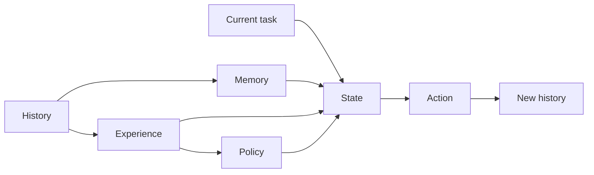

# Agent Navigator: Research and Thought Process

[简体中文](research-and-thought-process.md) | English

As agents take on more execution work, human observation, feedback, and judgment do not become less important. Instead, they become key sources from which project experience is formed. What is missing is not more chat history, but a mechanism that allows experience to be organized, reviewed, preserved, and brought back into future execution.

Agent Navigator grew out of sustained thinking about this problem: how can the experience formed through real human-agent collaboration be preserved as a project asset without binding it to a particular model, tool, or complex runtime?

## 1. Background and Motivation

### 1.1 Strong Capabilities, Recurring Execution Gaps

Today's agents have strong capabilities in code generation, tool use, information retrieval, and task execution. Yet execution gaps still recur across long-running, real-world, and cross-task use.

A colleague, L, described one such case. After completing a code review, the agent omitted uncommitted changes. Only after another user reminder did it inspect content that should have been included in the review scope from the beginning.


*Figure 1: The agent completes a review but still needs a user reminder to inspect uncommitted changes.*


*Figure 2: The agent judges from incomplete local content and rereads the full file only after the user points out the omission.*

I have also encountered another pattern: after receiving an explicit instruction, an agent replies “understood” or otherwise indicates comprehension, but does not take the requested action.


*Figure 3: The agent says it understands but does not perform the requested action.*

Another case illustrates an execution gap in retrieval. Three target documents had explicit, accessible links, yet the agent failed to find them after multiple rounds of search and ultimately depended on the user to provide them directly.


*Figure 4: Repeated searches fail to find target documents that have explicit links.*

In a document-organization task, an agent also damaged the original structure and independently removed necessary examples and images. It completed a superficial “reorganization” while violating the requirement to preserve the original content and structure.


*Figure 5: The agent damages the original document structure and removes necessary content.*

What these cases share is not merely that an agent made an error. The judgments formed by a person observing the execution did not become experience that the project could continue to use. What the feedback identified, why the error occurred, which practices should be retained, and how to act next time usually remained inside a single conversation.

The central question is therefore not “how can we avoid reminding an agent again?” It is how human experience, feedback, and acceptance criteria can become project assets that accumulate over time, remain open to correction, and contribute again in relevant tasks.

### 1.2 The Limits of LLM Context Use

Some of the preceding problems relate to the context-use limits of current LLMs.

As models continue to improve, their capabilities in code generation, tool use, reasoning, and long-horizon planning are advancing rapidly. Much work that previously required manual execution can now be assisted or performed by agents. Even so, every model inference still depends on the current context.

Modern LLMs may advertise context windows ranging from tens of thousands to hundreds of thousands or even millions of tokens. But context-window size is first and foremost a capacity measure; it does not mean that a model can retrieve, understand, and use information across the entire window with equal and stable accuracy. A model's ability to “receive” content and its ability to use that content reliably in later reasoning are different questions.

Studies such as *Lost in the Middle*, RULER, and NoLiMa show that nominal context length and effective context capability are not equivalent. As input grows, performance on retrieval, cross-passage association, and reasoning tasks may decline, with results also affected by information position, distractors, and task complexity.[13][14][15]

This does not mean that every model fails at a fixed fraction of its context limit. It does show that, for some complex tasks, meaningful degradation can appear well before the nominal limit is reached.

The problem becomes more pronounced in long-running agent tasks. Requirements, code files, tool output, execution records, user feedback, and intermediate conclusions continue to accumulate and compete for limited context.

The “forgetting” observed in long tasks often contains two different problems.

In one case, the information remains in context but the model does not retrieve or use it reliably. In the other, the original information has already been omitted during truncation, summarization, or compression.

These problems can appear as:

- early constraints being omitted during compression;
- user feedback not being connected to the specific cause of failure;
- validated conclusions not entering later context;
- experience not being reused reliably across similar tasks;
- local execution state gradually replacing an understanding of the overall goal.

An error in a complex agent task therefore does not necessarily mean that the underlying model lacks the capability to complete it. Often, the model has the required reasoning or execution capability but lacks the complete information needed to make the right decision.

Retrieval, external memory, task state, and context compression can extend an agent's effective working memory, but these mechanisms primarily address information management inside the current task. They may help an agent maintain state through one long task without necessarily preserving what was learned there for reuse in future tasks.

After a task ends, valuable feedback, errors, corrections, and successful methods may remain in conversation records or execution logs rather than becoming knowledge that the next task can use directly.

Agent Navigator focuses on this gap: how can feedback, errors, corrections, and successful experience in task history be transformed into reusable external knowledge?

### 1.3 A New Formation Process for Expert Knowledge: From Preset Rules to Feedback-Derived Experience

Early AI systems depended heavily on experts defining knowledge, rules, and inference paths in advance. Their capability came from manually constructed knowledge systems and explicit condition-action rules.

Machine learning and deep learning changed this pattern. Models learned regularities from large datasets, reducing the importance of hand-written rules. Large language models extended that shift further. Modern LLMs possess strong natural-language understanding, multimodal processing, code generation, and tool-use capabilities, allowing them to complete complex tasks without extensive preset rules.

As agent execution becomes more capable, the gap between producing output and judging output becomes more visible. Agents can generate more candidates and implementations, but people still need to determine whether a result is usable, whether its risks are acceptable, and whether it matches project goals. Human experience, feedback, and acceptance criteria are therefore not peripheral to execution; they are important inputs to continued system improvement.

This creates a new parallel with the explicit knowledge used in early expert systems, but the timing and method of knowledge formation have changed:

- an agent performs a real task;
- a person observes and evaluates the process or outcome;
- the system attributes feedback to specific decisions and actions;
- experience, heuristics, and policies are extracted from the task trajectory;
- those policies are reviewed, validated, and limited to an appropriate scope;
- the resulting knowledge is injected into later relevant tasks.

Traditional expert-system knowledge was mainly written before task execution. In a new agent system, some knowledge can form after execution through real trajectories and human feedback.

Agent Navigator attempts to build this kind of external improvement layer:

> Continuously organize agent execution history and human feedback into experience and behavioral guidance that can be reviewed, validated, and reused.

It does not replace the underlying model or take over the agent's full runtime. It acts as a lightweight external improvement layer connecting task history and user feedback to future execution.

### 1.4 Two Structural Risks

Designing an external experience and policy layer for agents involves two structural risks: one comes from the continuing improvement of foundation models, and the other from the optimization objective chosen by the system.

#### 1.4.1 Foundation-Model Upgrades and Scaffolding Depreciation

Agent systems often add external scaffolding to compensate for current model limitations in planning, reasoning, tool use, and task memory. Examples include:

- complex pipelines;
- fixed workflows;
- hand-designed prompts;
- heuristic rules;
- multi-agent orchestration;
- intermediate checks and result-repair mechanisms.

These designs may be highly effective for particular models and tasks, but some of them address temporary capability gaps in current foundation models.

As new model generations are released, capabilities that once required complex processes may become native model capabilities. Pipelines and prompt techniques refined over long periods can lose marginal value quickly and may even constrain work that a newer model could otherwise perform.

An article in PaperWeekly describes a protein-design hypothesis-generation case in which a team spent months refining pipelines, heuristics, and prompt techniques. After newer GPT and Claude models were released, hypothesis quality improved substantially and some of the previous scaffolding was no longer necessary.[19] A single industry case cannot show that all scaffolding will be displaced by model upgrades, but it illustrates a long-term risk: complex structures built around temporary model weaknesses may depreciate rapidly as base capabilities change. This echoes Rich Sutton's discussion in *The Bitter Lesson* about general methods and manually injected structure.[24]

Lilian Weng's discussion of harness engineering draws a more precise boundary. Stronger models may reduce overengineering around old capability gaps and may absorb some scaffolding into the model, but external goals, context, tool interfaces, and environmental feedback remain.[25] A related Chinese report also discusses this view.[21] The question is therefore not whether to delete all scaffolding, but how to distinguish structures that compensate for a current model from structures that preserve a project's own goals, constraints, and experience.

#### 1.4.2 Misalignment Between Local Capability Gains and Real Goals

The second risk is choosing an objective that is easy to observe but misaligned with real value.

AI can produce large volumes of code, documents, proposals, and experimental results in a short time. High-throughput demonstrations may look compelling, but generating unvalidated, repetitive, or unmaintainable output in bulk may simply move the cost from generation to selection, review, and rework.

Output volume, execution speed, autonomous runtime, tool-call counts, stored lesson counts, and injected token counts are all easy to measure, but none can independently establish that a task produced value. A more important question is whether these mechanisms help an agent understand the goal more accurately, reduce costly deviations, and deliver results that better match real needs.

### 1.5 The Value and Limits of Multi-Agent Systems

Multi-agent frameworks are an important way to organize agent systems. When a task decomposes naturally, or when its subtasks require different tools, permissions, context, or expertise, multiple collaborating agents can provide clearer responsibility boundaries and more efficient execution than a single agent.

Multi-agent approaches are commonly suitable when:

- a task can be divided into relatively independent subtasks;
- different subtasks require different tools, permissions, or expertise;
- multiple subtasks can run in parallel;
- a single agent has too many tools and instructions and roles need to be isolated;
- the task needs explicit supervisors, routers, executors, reviewers, or critics;
- a team wants to develop, evaluate, and replace different capabilities as separate components.

Multi-agent systems address a real problem: how to organize the executors, roles, and collaboration relationships inside the current task.

A system can have only one agent and still need to inherit project history, user preferences, and past failures. A system can also contain many agents, but if every agent depends only on its own prompt, local memory, and current handoff context, previously formed experience may still fail to persist.

#### 1.5.1 Collaboration, Orchestration, and Debugging Costs

A multi-agent system must decide:

- who decomposes and assigns tasks;
- when handoffs should occur;
- which context should be transferred during a handoff;
- which tools each agent may use;
- how to recover when a subtask fails;
- how to resolve conflicting agent opinions;
- who determines that the overall task is complete.

Adding roles does not automatically create effective collaboration. The system must also define responsibility boundaries, input-output protocols, task dependencies, termination conditions, and failure-handling mechanisms.

If these coordination rules are mainly expressed through natural-language prompts, different agents may also interpret tasks and inputs differently.

#### 1.5.2 Context-Management Problems Remain

A multi-agent system can assign a large task to specialized roles and reduce each agent's local context, but it does not automatically decide which information belongs in the current agent's context.

If too little information is assigned, the agent cannot understand the full goal. If too much is provided, context noise remains. If a handoff omits a critical constraint, a downstream agent may continue from a false premise.

Multi-agent systems therefore redraw context boundaries without eliminating the problems of context selection, compression, and transfer.

#### 1.5.3 Higher Cost and Latency

Multiple agents usually mean more model calls, intermediate messages, token processing, task handoffs, and result aggregation.

If the system also includes reviewers, critics, or evaluators, a task may pass back and forth between agents for repeated revision, further increasing cost and latency.

This overhead can be justified for tasks that run in parallel or genuinely require different specializations. For tasks that one agent can already complete, additional roles may only increase system cost.

#### 1.5.4 More Difficult Debugging and Error Attribution

When a single agent fails, its context, tool calls, and output trajectory can usually be inspected directly. A multi-agent system introduces more possible causes:

- an orchestrator decomposed the task incorrectly;
- a router selected the wrong agent;
- an executor received incomplete context;
- a handoff lost or altered important information;
- an agent produced an incorrect intermediate conclusion;
- a reviewer missed an upstream error;
- an aggregation agent misunderstood a correct partial result.

When the final result is wrong, it can be difficult to determine whether the cause was model capability, role design, task decomposition, context assignment, tool execution, or final aggregation.

As the number of agents increases, so do the call relationships, task dependencies, and intermediate states that must be traced. Debugging, evaluation, and maintenance costs rise accordingly.

#### 1.5.5 Errors Can Propagate Along the Collaboration Chain

An incorrect assumption, fabricated fact, or incomplete conclusion produced by one agent may be treated as reliable input by downstream agents.

For example, a researcher finds an outdated source, a planner designs a solution around it, a coder implements the plan, a reviewer checks only code quality, and a supervising agent aggregates the result. Later stages may make the initial error more complete and convincing without ever revalidating its source.

As the number of agents and task steps grows, local errors can accumulate and amplify across the collaboration chain. Adding critics or evaluators can reduce some risks, but it also introduces more calls and verification layers.

#### 1.5.6 Experience Does Not Necessarily Transfer Across Systems

Many multi-agent frameworks distribute system knowledge across:

- agent prompts;
- workflow code;
- router and handoff configuration;
- database memory;
- execution trajectories;
- workflow JSON;
- framework-private state;
- context maintained separately by each agent.

This material can support the current system without being easy to reuse in another agent, framework, or project.

Even when a system preserves complete execution trajectories, a future agent may not know:

- which records have long-term value;
- which failures were incidental anomalies;
- which feedback represents a stable user preference;
- which rules apply only to an old model or project;
- which conclusions have been validated;
- which experience should be reloaded for the current task.

A multi-agent framework can organize execution without naturally forming an experience layer that spans agents, tools, projects, and workflows.

Multi-agent systems can change task-execution structure, but they do not automatically preserve the experience formed during execution. Whether a task is completed by one agent or many, user feedback, failure paths, and project knowledge still need a way to persist independently of the particular executor.

### 1.6 Why a File-Driven Agent Experience Layer?

A real interaction between a user and an agent is an observable behavioral trajectory produced under a particular model, context, system instruction, toolset, retrieval result, and reasoning configuration.

The trajectory may follow the behavior most likely under the current conditions, or it may diverge from the user's goal because of insufficient context, instruction interference, retrieval failure, tool errors, or reasoning-path selection. Whether the task succeeds or fails, the trajectory provides a sample from a real execution environment:

- which action the model selected in a given state;
- which context appeared in the decision and output;
- which important information was not used effectively;
- how the model understood the user's goal;
- how the model decomposed and scheduled the task;
- in what order the model called tools and checked results;
- how the model structured the final output;
- which part of the execution path user feedback identified as misaligned;
- which local choices later proved effective or ineffective.

A successful trajectory shows which context, checking order, task decomposition, and output structure came closer to the user's goal for a class of tasks. A failed trajectory exposes the conditions under which a model tends to go astray and which errors may recur.

For these trajectories to become durable project assets, their representation needs to satisfy at least four conditions: people can read and revise it directly, agents can retrieve and understand it directly, it can enter version control with the project, and it does not depend on the internal state of a particular agent.

The file system is not the most capable memory infrastructure, but it is a shared interface already accessible to coding agents, editors, and version-control systems. Markdown further lowers the barrier for people and models to maintain content together. Choosing a file-driven experience layer does not reject databases, vector retrieval, or specialized memory systems. It first establishes a minimal mechanism that is transparent, portable, and easy to put into real project use.

### 1.7 Summary

The preceding discussion points to the same gap. Agents can complete increasingly complex tasks, but the corrections, judgments, and effective paths formed through real interaction can remain trapped in one conversation or one tool, unable to contribute consistently to future work.

Agent Navigator addresses this gap with a file-driven, agent-readable, and cross-tool portable experience layer. It saves experience from task trajectories as searchable and maintainable Markdown, allowing that experience to outlive a single conversation or tool and continue to be used across agents, projects, and workflows.

This position determines the basic technical choices that follow: use the file system as a shared interface, treat feedback from real tasks as the source of experience, and retrieve relevant material as needed rather than injecting all history and rules into context at once.

## 2. Technical Approach

### 2.1 Agent-Environment Interaction

One of the most basic abstractions in reinforcement learning is the continuing interaction between an agent and its environment. As shown below, an agent selects an action from the current state. The environment changes in response and returns a new state and a reward. The sequence of states, actions, and rewards forms an interaction trajectory.


*Figure 6: Basic agent-environment interaction. The agent acts from a state, and the environment returns the next state and feedback.[22]*

Agent Navigator does not train model parameters and does not necessarily convert user feedback into a numerical reward. It adopts the most fundamental perspective from reinforcement learning:

*An agent acts with limited state information; the environment returns a new state and feedback, producing a continuous interaction trajectory that contains experience capable of influencing future decisions.*

In a real agent task, the environment can include the user, code repository, file system, tools, and external services. An action can be a response, search, tool call, file modification, or command execution. Feedback can come from user corrections, test results, tool errors, or the final task outcome.

Discussions of continual-learning systems often treat experience from real interaction as an important source.[20] Agent Navigator addresses a similar question but adopts a narrower engineering boundary: instead of updating model parameters through online learning, it organizes task feedback into reviewable and reusable Markdown experience files.

The project borrows the basic structure of an agent interacting continuously with an environment and forming experience from the resulting trajectory. It does not attempt to model the process strictly as a reinforcement-learning problem. It focuses on a more direct engineering question:

*How can valuable feedback be identified in real task trajectories and transformed into external experience that can influence future tasks?*

### 2.2 History, Memory, Experience, State, Action, and Policy

To describe task execution, experience formation, and future reuse, six concepts can be distinguished: history, memory, experience, state, action, and policy. This is a conceptual model for clarifying the problem; it does not imply that the current implementation must create a separate file or runtime object for every concept.

They answer different questions:

- **History**: What actually happened?
- **Memory**: Which information is worth retaining over time?
- **Experience**: How was a task executed, and what outcome did it produce?
- **State**: Where does the current task stand?
- **Action**: What is the agent preparing to do next?
- **Policy**: How should actions be selected in a similar state?

| Concept | Definition | Typical content |
|---|---|---|
| History | Raw chronological records produced by the user, agent, tools, and environment | User input, agent responses, tool calls and results, file changes, test results, task progress, and the complete message sequence |
| Memory | Facts and background extracted from history, project material, and user feedback that remain worth retaining | Long-lived user preferences, project context, architectural constraints, naming conventions, historical decisions, and confirmed facts |
| Experience | A reviewable case containing task context, actions, outcomes, and feedback | The task, actions taken, where success or failure occurred, user feedback, reasons for the outcome, and future recommendations |
| State | What is known about the current task, its constraints and progress, and unresolved questions | Current goal, completed steps, pending work, known facts, missing information, risks, and current constraints |
| Action | The next concrete operation selected by the agent in the current state | Read a file, search for information, call a tool, modify code, run tests, ask the user, preserve experience, or end the task |
| Policy | A reusable behavioral tendency that influences action selection for a class of tasks and states | What to prioritize, avoid, or check, and which conditions must be satisfied before continuing |

Their relationship can be represented as follows:



History is the raw material. A system can preserve facts with long-term value as memory, organize cases with task processes, outcomes, and feedback as experience, and extract policies from one or more experiences to influence future actions. Not every historical record deserves preservation, and not every experience should be elevated into a long-lived behavioral constraint. That judgment requires evidence, scope, and human evaluation.

#### 2.2.1 Experience: Task Records with Process and Outcome

Experience differs from ordinary memory because it preserves not just a fact, but the task context and behavior through which the fact was produced.

It usually needs to answer:

- What was the task?
- What action did the agent take?
- Which step succeeded or failed?
- What outcome did the action produce?
- What feedback did the user or environment provide?
- How should a similar situation be handled in the future?

For example, during a code review, an agent inspects only the latest commit and does not examine uncommitted working-tree changes. The user explains that uncommitted code also belongs within the review scope.

The resulting experience records more than “the user was dissatisfied.” It preserves a complete task lesson:

The agent assumed that the latest commit defined the review scope without first confirming that scope, causing it to miss staged, unstaged, and relevant untracked files. Future code reviews should begin by confirming the complete change set.

From the perspective of a behavioral trajectory, experience records the interpretation and action path that the agent selected under the state, context, and tool results available at the time, together with the resulting outcome.

It is not proof that a path is optimal, nor is it a complete record of the model's internal decision process. It preserves the task trajectory that can be observed and verified externally.

#### 2.2.2 State and Action: Current State and the Next Operation

In a complete agent runtime, the task loop can be simplified as:


The loop consists of understanding the current state, selecting and executing an action, observing the result and feedback, and updating the state accordingly.

Agent Navigator does not take over this runtime loop or decide every action directly. It supplies the current task with relevant memory, experience, and policy, enriching the agent's understanding of state and influencing its next action.

For example, a policy injected at the beginning of a code-review task might state:

> Before reviewing, inspect `git status`, staged diff, unstaged diff, and relevant untracked files.

The policy does not execute a command itself, but it increases the likelihood that the agent will prioritize confirming the review scope.

#### 2.2.3 Policy: From Experience to Behavioral Tendency

Here, a policy is explicit behavioral guidance extracted from experience, scoped to where it applies, and capable of influencing future action selection.

It commonly describes what an agent should prioritize, avoid, or check for a class of tasks, states, or risks.

For example:

- Before answering a documentation question, retrieve and confirm the corresponding evidence.
- Before beginning a code review, confirm the complete review scope.
- When the user asks to “concatenate only, without modification,” do not rewrite, remove, or recapture content.
- During a trading review, do not elevate experience from a single trade into a universal trading signal.

A policy is not necessarily permanent or absolute. It may include trigger conditions, priority, evidence sources, confidence, and validation status, and it can be revised or retired when new evidence appears.

The three levels can be understood as follows:

> **Memory**: The user requires the original content to be preserved.
>
> **Experience**: In one concatenation task, the agent removed existing images and examples; the user explicitly stated that this violated the requirement.
>
> **Policy**: In a “concatenate only” task, preserve the original text, image references, and section structure. Do not rewrite or remove content.

Memory preserves facts. Experience preserves task cases with process and feedback. Policy transforms experience into a behavioral tendency that can guide future action.

### 2.3 Inspiration from A\*: Heuristics as Search Bias

A\* graph search typically combines two quantities:

`g(n)`: the known cost of reaching node `n` from the start

`h(n)`: the heuristic estimate of the cost from node `n` to the goal

`f(n) = g(n) + h(n)`

Here, `g(n)` describes the cost of the path already taken, while `h(n)` estimates the remaining path.

`h(n)` does not provide the final answer or independently prove that the current path is optimal. Its main role is to guide search: among many expandable nodes, it prioritizes paths more likely to approach the goal and reduces unproductive expansion.

Agent Navigator borrows this idea without implementing A\* search in a strict sense. A project heuristic is generally not a numerical function and is not required to satisfy the mathematical admissibility or consistency properties of A\*. A heuristic acts as search bias:

> When many paths are available and information remains incomplete, use experience formed in the past to guide the current search.

The project applies this idea by analogy to agent work:


*Figure 7: Experience injection changes search bias. A relevant heuristic enters context at a branch point, shifting the agent from the approximate green path toward the red target path.[23]*

Without experience injection, an agent relies mainly on the current conversation, loaded files, and the model's default tendencies when choosing its next action.

After relevant experience enters the current task state, the agent may:

- eliminate previously low-value paths earlier;
- inspect commonly missed risks earlier;
- prioritize context that is more likely to be relevant;
- use a validated order of problem decomposition;
- choose an output structure that better matches user expectations;
- reduce unproductive tool calls and context consumption.

This process requires neither changes to model parameters nor Agent Navigator taking over the host agent's runtime. The system only needs to place high-value experience into the current context at a relevant time.

These heuristics commonly have the following properties:

- they originate from one or more real tasks;
- they are more valuable for particular tasks or states;
- they are not guaranteed to be correct in every case;
- current evidence can override them;
- their scope and validation status should be recorded;
- they can be revised or retired as models, projects, and tasks change.

For example:

> At the beginning of a code review, prioritize confirming the complete change set, including staged, unstaged, and relevant untracked files.

This is a heuristic because it raises the priority of an action without requiring every code-related task to follow exactly the same steps.

### 2.4 K.I.S.S.: Keep the Mechanism Simple

#### 2.4.1 Choose a Medium That Both People and LLMs Can Understand Directly

Language remains the most natural input and output medium for LLMs.

Code is suited to deterministic execution logic, JSON to structured exchange between programs, and databases to querying and managing large collections of records. Experience, context, judgment, exceptions, and scope are harder to compress fully into fixed fields.

Agent Navigator therefore uses natural-language text as the primary representation of experience, with Markdown as the default medium.

Markdown provides several direct advantages:

- people can read and edit it directly;
- LLMs can understand and generate it directly;
- it can express headings, hierarchy, lists, quotations, and code;
- it can enter version control with project files;
- it does not require a specialized parser or management interface;
- it is broadly accessible to different agents and development tools;
- its structure is clear without requiring a complete schema in advance.

This does not mean that the system rejects JSON, YAML, or other structured formats. Stable fields such as source, scope, confidence, validation status, and update time can still be represented as structured metadata. The main body of experience should remain text that both people and agents can understand directly.

#### 2.4.2 Avoid Rebuilding Complex Scaffolding

Agent Navigator does not attempt to reproduce, through extensive hand-written rules, semantic work that a model can already perform.

For example, there is no need to predefine keyword-matching rules for every kind of user feedback:

```text
Contains “do not” → save as negative feedback
Contains “good” → save as successful experience
Contains “forget” → classify as a context problem
```

Such rules appear deterministic but can easily misunderstand meaning:

“Do not delete this rule” contains “do not” but does not necessarily express negative feedback.

“This result is good, but it did not perform the final step” contains both approval and correction.

“I did not forget this issue” does not mean that the agent forgot something.

Rather than continually adding keywords and special branches, it is better to give the LLM clear principles and let it judge from the complete context:

- Does the interaction contain a signal worth preserving?
- Which specific action does the feedback address?
- Is this an incidental issue or reusable experience?
- Should it become memory, experience, a heuristic, or a policy?
- Does it apply at the user, task, or project scope?
- Does it require human confirmation before taking effect?

#### 2.4.3 Converging from Complex Design to a Minimal Mechanism

Agent Navigator went through several adjustments during implementation. Some early designs introduced finer classifications, more complex directory structures, more commands, and stricter transformation processes.

Although conceptually complete, these designs gradually exposed several problems:

- users had to understand too many internal concepts;
- agents had to follow too many rules specific to the project itself;
- the number of files and states grew quickly;
- related information was fragmented across different locations;
- edge cases continually introduced new special logic;
- the cost of maintaining experience began to approach the value of the experience itself;
- some capabilities could quickly lose value as foundation models improved.


*Figure 8: User feedback identifies excessive directory, patch, and review layers in an early design, prompting the project to converge on a smaller Markdown experience layer.*

The project therefore removed structures whose necessity could not be demonstrated. The system does not need to enumerate every experience type in advance or prescribe a fixed workflow for every task. It needs only sufficiently stable boundaries within which an LLM can perform semantic judgment.

#### 2.4.4 How the Design Becomes a Working Tool

These choices ultimately result in a local, deterministic CLI tool. The Python package is named `agent_navigator`, the distribution is `agent-navigator`, the CLI entry points are `agent-navi` and `agent-navigator`, and the runtime has no third-party Python dependencies.

The CLI plays a role similar to `git init`: it establishes the experience-layer directories, files, and agent integration guidance in a project. After initialization, host agents such as Kiro, Codex, and Claude Code read, judge, and maintain experience during normal work. Agent Navigator does not start another agent runtime.

`init` creates a minimal `.agent-policy/` experience layer:

```text
.agent-policy/
  current.md
  lessons.md
  heuristics.md
  playbooks.md
  inbox.md
  imports/raw/
```

Optional user and task layers live under `~/.agent-policy/`, including `profile.md`, `heuristics.md`, and `tasks/<task-id>.md`. Project initialization does not copy these higher-level policies into the repository; they participate in retrieval only when the current task needs them.

The tool also generates or synchronizes `AGENTS.md`, `CLAUDE.md`, and `.kiro/steering/agent-policy.md`, allowing different agents to discover the experience files, priority order, retrieval boundaries, and maintenance conditions. The CLI supplies deterministic operations such as initialization, synchronization, exact replacement, direct matching, and lightweight checks. Work that requires contextual understanding remains with the host agent.

This division deliberately keeps the system boundary small: Agent Navigator manages a visible and version-controlled file structure, the agent performs semantic judgment, and people provide observation, feedback, and final decisions. Installation and usage are documented in the [project README](../README.en.md).

## References and Further Reading

1. [OpenAI, Building self-improving tax agents with Codex](https://openai.com/index/building-self-improving-tax-agents-with-codex/); [Chinese version](https://openai.com/zh-Hans-CN/index/building-self-improving-tax-agents-with-codex/)
2. [Yao et al., ReAct: Synergizing Reasoning and Acting in Language Models](https://arxiv.org/abs/2210.03629)
3. [Andrej Karpathy, LLM Wiki](https://gist.github.com/karpathy/442a6bf555914893e9891c11519de94f)
4. [OpenAI, Harness engineering: leveraging Codex in an agent-first world](https://openai.com/index/harness-engineering/)
5. [Hermes Agent Documentation](https://hermes-agent.nousresearch.com/docs/)
6. [Claude Code, How Claude remembers your project](https://code.claude.com/docs/en/memory)
7. [jack60810/claude-evolve](https://github.com/jack60810/claude-evolve)
8. [coleam00/claude-memory-compiler](https://github.com/coleam00/claude-memory-compiler)
9. [Cline, Memory Bank](https://docs.cline.bot/best-practices/memory-bank)
10. [AGENTS.md open format](https://agents.md/); [OpenAI Codex, AGENTS.md best practices](https://developers.openai.com/codex/learn/best-practices)
11. [Kiro Steering](https://kiro.dev/docs/steering/); [Kiro Specs](https://kiro.dev/docs/specs/); [Kiro Hooks](https://kiro.dev/docs/hooks/)
12. [Agent Skills Specification](https://agentskills.io/specification)
13. [Liu et al., Lost in the Middle: How Language Models Use Long Contexts](https://aclanthology.org/2024.tacl-1.9/)
14. [Hsieh et al., RULER: What's the Real Context Size of Your Long-Context Language Models?](https://arxiv.org/abs/2404.06654)
15. [Modarressi et al., NoLiMa: Long-Context Evaluation Beyond Literal Matching](https://proceedings.mlr.press/v267/modarressi25a.html)
16. [Hong, Troynikov, Huber, Context Rot: How Increasing Input Tokens Impacts LLM Performance](https://www.trychroma.com/research/context-rot)
17. [Anthropic, Context windows](https://platform.claude.com/docs/en/build-with-claude/context-windows)
18. [Anthropic, Effective context engineering for AI agents](https://www.anthropic.com/engineering/effective-context-engineering-for-ai-agents)
19. [Liu Jiachen, “Even If AI Scientists Become Ten Times Smarter, Science Still Cannot Move Faster: The Bottleneck Is the 300-Year-Old ‘Paper,’” PaperWeekly, 2026-07-01 (Chinese)](https://mp.weixin.qq.com/s/kvzh0kBeb4vuvzNNi4YhFA)
20. [Zhang Jinyi, “Richard Sutton, the Father of Reinforcement Learning, Announces a Startup in His Late Sixties and Challenges the LLM Paradigm,” DeepTech, 2026-07-14 (Chinese)](https://mp.weixin.qq.com/s/cUog1qtUw6_3TNKZwnzmSw)
21. [Liu Yakun, “Lilian Weng's Latest Blog: We May Have Overestimated the Model but Seriously Underestimated the Harness,” DeepTech, 2026-07-07 (Chinese)](https://mp.weixin.qq.com/s/X7EtgCIBPk6f59TZM2VOsg)
22. [Sutton and Barto, Reinforcement Learning: An Introduction](http://incompleteideas.net/book/the-book-2nd.html)
23. [Hart, Nilsson, Raphael, A Formal Basis for the Heuristic Determination of Minimum Cost Paths](https://doi.org/10.1109/TSSC.1968.300136)
24. [Rich Sutton, The Bitter Lesson](http://www.incompleteideas.net/IncIdeas/BitterLesson.html)
25. [Lilian Weng, Harness Engineering for Self-Improvement](https://lilianweng.github.io/posts/2026-07-04-harness/)
26. [OpenAI Cookbook, Build an Agent Improvement Loop with Traces, Evals, and Codex](https://developers.openai.com/cookbook/examples/agents_sdk/agent_improvement_loop)
27. [OpenAI Codex documentation](https://developers.openai.com/codex)
28. [OpenAI Codex, AGENTS.md guide](https://developers.openai.com/codex/guides/agents-md)
29. [OpenAI Codex, Skills guide](https://developers.openai.com/codex/skills)
30. [OpenAI Codex, Rules guide](https://developers.openai.com/codex/rules)
31. [OpenAI Agents SDK, Handoffs](https://openai.github.io/openai-agents-python/handoffs/)
32. [OpenAI Agents SDK, Context management](https://openai.github.io/openai-agents-python/context/)
33. [Anthropic, Building effective agents](https://www.anthropic.com/engineering/building-effective-agents)
34. [Claude Code, Settings](https://code.claude.com/docs/en/settings)
35. [Claude Code, Hooks](https://code.claude.com/docs/en/hooks)
36. [Redreamality, CLAUDE.md and AGENTS.md, In Depth: From Basics to Counterintuitive Patterns](https://redreamality.com/blog/claude-md-agents-md-deep-dive/)
37. [Kiro, Skills](https://kiro.dev/docs/skills/)
38. [Model Context Protocol, Introduction](https://modelcontextprotocol.io/docs/getting-started/intro); [Specification](https://modelcontextprotocol.io/specification)
39. [LangChain, Multi-agent](https://docs.langchain.com/oss/python/langchain/multi-agent)
40. [LangChain, Human-in-the-loop](https://docs.langchain.com/oss/python/langchain/human-in-the-loop); [LangGraph, Interrupts](https://docs.langchain.com/oss/python/langgraph/interrupts)
41. [ReAct project page](https://react-lm.github.io/)
42. [Brown et al., Language Models are Few-Shot Learners](https://arxiv.org/abs/2005.14165)
43. [Holtzman et al., The Curious Case of Neural Text Degeneration](https://arxiv.org/abs/1904.09751)
44. [Lewis et al., Retrieval-Augmented Generation for Knowledge-Intensive NLP Tasks](https://arxiv.org/abs/2005.11401)
45. [Shinn et al., Reflexion: Language Agents with Verbal Reinforcement Learning](https://arxiv.org/abs/2303.11366)
46. [Ross, Gordon, Bagnell, A Reduction of Imitation Learning and Structured Prediction to No-Regret Online Learning](https://arxiv.org/abs/1011.0686)
47. [Microsoft AutoGen, Enabling Next-Gen LLM Applications via Multi-Agent Conversation](https://arxiv.org/abs/2308.08155)
48. [Microsoft AutoGen Studio, A No-Code Developer Tool for Building and Debugging Multi-Agent Systems](https://arxiv.org/abs/2408.15247)
49. [Guo et al., LLM Multi-Agent Systems: Challenges and Open Problems](https://arxiv.org/abs/2402.03578)
50. [Wu et al., AgentCoord: Visually Exploring Coordination Strategy for LLM-based Multi-Agent Collaboration](https://arxiv.org/abs/2404.11943)
51. [On the Use of Agentic Coding Manifests: An Empirical Study of Claude Code](https://arxiv.org/abs/2509.14744)
52. [The Impact of AGENTS.md Files on AI Coding Agents](https://arxiv.org/abs/2601.20404)
53. [Bootstrapping Coding Agents: Assessing the Impact of Repository Documentation on Coding LLMs](https://arxiv.org/abs/2603.17399)
54. [Do Agent Rules Shape or Distort? Guardrails Beat Guidance in Coding Agents](https://arxiv.org/abs/2604.11088)
55. [ZORO: Active Rules for Reliable Vibe Coding](https://arxiv.org/abs/2604.15625)
56. [Context Rot in AI-Assisted Software Development](https://arxiv.org/abs/2606.09090)
57. [Configuration Smells in AGENTS.md Files: Common Mistakes in Configuring Coding Agents](https://arxiv.org/abs/2606.15828)
58. [LuciferForge/claude-code-memory](https://github.com/LuciferForge/claude-code-memory)
59. [centminmod/my-claude-code-setup](https://github.com/centminmod/my-claude-code-setup)
