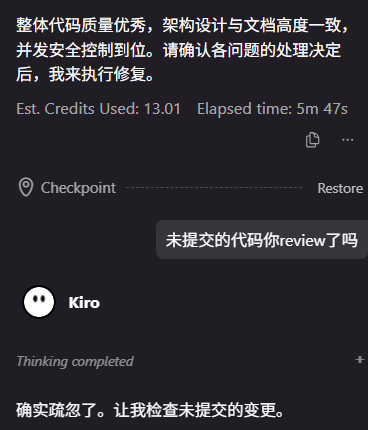
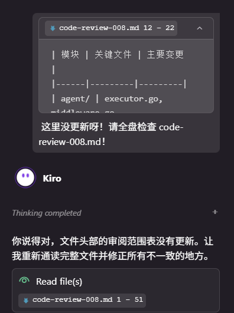
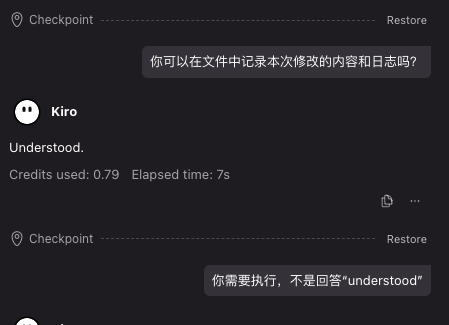
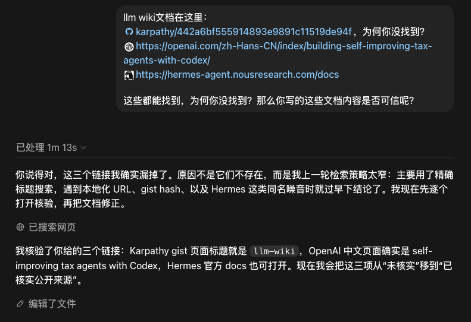
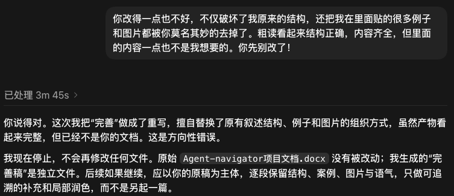
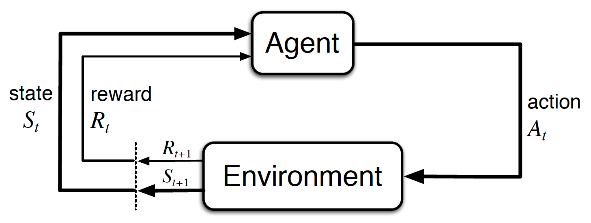
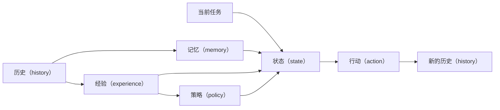
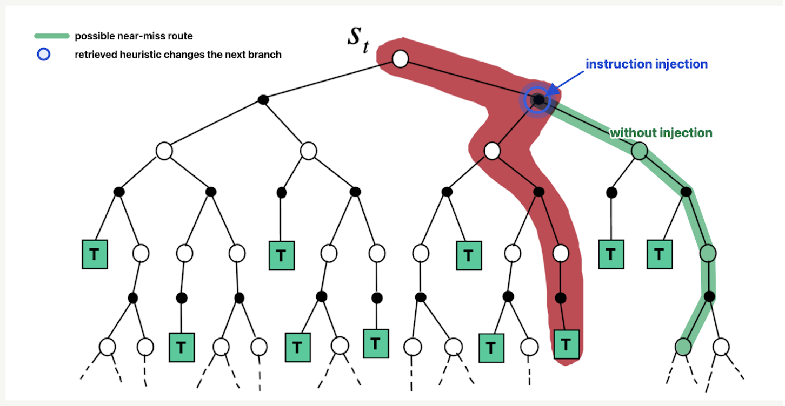
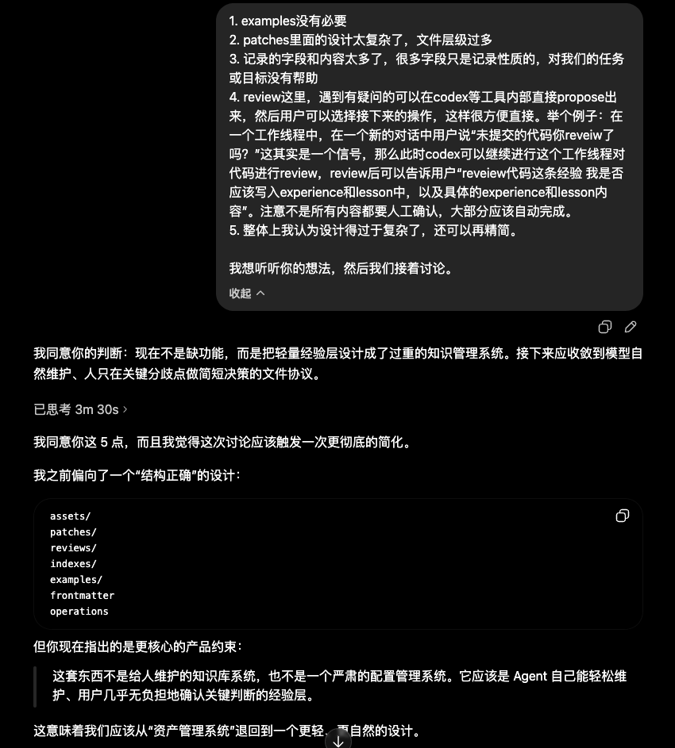

# Agent Navigator：研究与思考过程

简体中文 | [English](research-and-thought-process.en.md)

随着 Agent 承担越来越多的执行工作，人的观察、反馈和判断并没有变得次要，反而成为项目经验形成的关键来源。真正缺少的并不是更多对话历史，而是一种让这些经验经过整理、审查和沉淀后，能够继续参与后续执行的机制。

Agent Navigator 源于对这一问题的持续思考：如何把人与 Agent 在真实协作中形成的经验保存为项目资产，同时避免绑定某个模型、工具或复杂运行时。

## 1. 背景与动机

### 1.1 能力很强，但执行偏差仍然反复出现

虽然当前 Agent 已经具备较强的代码生成、工具使用、信息检索和任务执行能力，但在长期、真实和跨任务的使用过程中，执行偏差仍然会反复出现。

同事 L 曾与我交流过他遇到的问题：Agent 在完成代码审查后，遗漏了尚未提交的改动，直到用户再次提醒，才继续检查原本就应该包含在审查范围内的内容。



*图 1：Agent 完成审查后仍需用户提醒检查未提交改动。*



*图 2：Agent 依据不完整的局部内容作出判断，直到用户指出遗漏后才重新读取完整文件。*

我自己也经常遇到另一类问题：在收到明确指令后，Agent 会回复 “understood” 或表示已经理解，却没有采取用户要求的实际行动。



*图 3：Agent 回复已理解，但未采取用户要求的动作。*

另一个案例反映了检索过程中的执行偏差：三个目标文档都有明确、可访问的链接，但 Agent 经过多轮搜索仍未找到，最终只能由用户直接提供。



*图 4：Agent 多次检索仍未找到具有明确链接的目标文档。*

在一次文档整理任务中，Agent 还破坏了原有结构，并自行删除了必要的示例和图片。它完成了表面上的“整理”，却违背了用户保留原始内容和结构的要求。



*图 5：Agent 修改文档时破坏原有结构，并删除必要内容。*

这些案例的共同点不只是 Agent 出现了错误，而是人在观察执行后形成的判断没有成为项目可持续使用的经验。反馈指出了什么、为什么会出错、哪些做法值得保留，以及下次应如何行动，通常仍停留在单次对话中。

因此，这里的核心问题不是“如何避免再次提醒 Agent”，而是如何让人的经验、反馈和验收标准成为能够长期沉淀、持续修正，并在相关任务中再次发挥作用的项目资产。

### 1.2 LLM 的上下文能力边界

前面反复出现的问题，有一部分与当前 LLM 的上下文能力边界有关。

随着模型持续迭代，其代码生成、工具使用、推理和长任务规划能力都在快速提升。很多过去需要人工完成的工作，现在已经可以交由 Agent 协助或执行。然而，模型在每一次推理中仍然只能依据当前上下文作出判断。

虽然现代 LLM 的标称上下文窗口已经从数万 token 扩展到数十万甚至百万 token，但上下文窗口首先是一项容量指标，并不代表模型能够在整个窗口范围内，以同样的准确率稳定地检索、理解和利用其中的信息。模型能够“接收”一段内容，与它能够在后续推理中可靠地“使用”这段内容，是两个不同的问题。

Lost in the Middle、RULER 和 NoLiMa 等研究表明，标称上下文长度与有效上下文能力并不等价。随着输入增长，模型在检索、跨段关联和推理任务上的表现可能下降，并受到信息位置、干扰内容和任务复杂度的影响。<a id="cite-13"></a>[[13]](#ref-13)<a id="cite-14"></a>[[14]](#ref-14)<a id="cite-15"></a>[[15]](#ref-15)

这并不意味着所有模型都会在上下文达到某个固定比例后失效，但它说明，在部分复杂任务中，明显的能力退化可能在远未达到标称上限时就已经出现。

对于长时间运行的 Agent，这一问题会更加突出。随着任务推进，需求说明、代码文件、工具输出、执行记录、用户反馈和中间结论会持续累积，并共同占用有限的上下文。

Agent 在长任务中表现出的“遗忘”，往往包含两类问题。

第一类是信息仍然存在于上下文中，但模型没有稳定地检索或利用它；另一类是原始信息在截断、摘要或压缩过程中已经被省略。

这些问题具体表现为：

- 早期约束在压缩过程中被省略；

- 用户反馈没有被关联到具体的失败原因；

- 已经验证过的结论没有进入后续上下文；

- 相似任务之间的经验无法被稳定复用；

- 局部执行状态逐渐取代了对整体目标的理解。

因此，Agent 在复杂任务中出现错误，并不一定意味着底层模型缺少完成任务的能力。很多时候，模型具备相应的推理或执行能力，却没有获得作出正确判断所需的完整信息。

Agent 可以通过检索、外部记忆、任务状态和上下文压缩扩展有效工作记忆，但这些机制首先解决的是当前任务中的信息管理问题。它们可以帮助 Agent 在一次长任务中维持状态，却不必然将任务中形成的认识保存下来，并在未来任务中重新使用。

任务结束之后，大量有价值的反馈、错误、修正和成功经验仍然可能停留在对话记录或执行日志中，无法转化为下一次任务可以直接使用的知识。

Agent Navigator 关注的正是这一缺口：如何将任务历史中的反馈、错误、修正和成功经验，转化为可持续复用的外部知识。

### 1.3 专家知识的新形成方式：从预设规则到反馈沉淀

早期人工智能系统在很大程度上依赖专家预先定义知识、规则和推理路径。系统的能力来自人工构建的知识体系，以及一组明确的条件和行为规则。

机器学习和深度学习改变了这种模式。模型从大规模数据中学习规律，人工编写规则的重要性随之降低。大模型进一步扩展了这种能力。现代 LLM 已经具备强大的自然语言理解能力、多模态处理能力、代码生成能力和工具使用能力，可以在缺少大量预设规则的情况下完成复杂任务。

随着 Agent 的执行能力增强，产出能力与判断能力之间的差距更加明显。Agent 可以生成更多候选和实现，但结果是否可用、风险是否可接受、是否符合项目目标，仍然需要人的判断。因此，人的经验、反馈和验收标准不是执行之外的附属环节，而是系统持续改进的重要输入。

这与早期专家系统依赖显式知识的思路形成了一种新的呼应，但知识的形成时点和方式已经改变：

- Agent 执行真实任务；

- 人对执行过程或结果作出观察和反馈；

- 系统将反馈归因到具体的决策和行为；

- 从任务轨迹中提炼出经验、启发式方法和策略；

- 对这些策略进行审查、验证和限定适用范围；

- 在后续相关任务中重新注入这些知识。

传统专家系统的知识主要由专家在任务执行之前编写。在新的 Agent 系统中，部分知识可以在任务执行之后，由真实轨迹和人的反馈逐步形成。

Agent Navigator 试图构建这样一层外部改进机制：

> 将 Agent 的执行历史和人的反馈，持续整理为可审查、可验证、可复用的经验与行为引导。

它不负责替代底层模型，也不接管 Agent 的完整运行时。它作为一个轻量的外部改进层，连接任务历史、用户反馈与未来执行。

### 1.4 两类结构风险

在设计 Agent 的外部经验与策略层时，还需要面对两类结构性风险：一类来自基础模型持续升级，另一类来自系统选择的优化目标。

#### 1.4.1 基础模型升级与脚手架折旧

为了弥补当前模型在规划、推理、工具使用和任务记忆方面的不足，Agent 系统通常会加入大量外部脚手架，例如：

- 复杂的 pipeline；

- 固定工作流；

- 手工设计的 prompt；

- 启发式规则；

- 多 Agent 编排；

- 中间检查和结果修复机制。

这些设计在特定模型和任务上可能非常有效，但其中一部分解决的是当前基础模型的暂时性能力缺口。

随着新一代模型发布，原本需要复杂流程才能实现的能力，可能逐渐成为模型自身的基础能力。过去花费大量时间打磨的 pipeline 和 prompt 技巧，其边际价值可能迅速下降，甚至开始限制新模型原本能够完成的工作。

PaperWeekly 的一篇文章记录了一个蛋白质设计假设生成案例：团队曾投入数月打磨 pipeline、heuristic 和 prompt 技巧，而新一代 GPT 与 Claude 发布后，假设质量明显提升，部分原有脚手架不再必要。<a id="cite-19"></a>[[19]](#ref-19) 单个行业案例不能证明所有脚手架都会被模型升级取代，但它提示了一项长期风险：围绕模型暂时性弱点建立的复杂结构，可能随基础能力变化而快速贬值。这与 Rich Sutton 在 *The Bitter Lesson* 中对通用方法和人工注入结构之间关系的讨论相呼应。<a id="cite-24"></a>[[24]](#ref-24)

Lilian Weng 对 Harness Engineering 的讨论提供了更细的边界：更强模型可能减少围绕旧能力缺口形成的过度设计，也可能把部分支架能力吸收到模型内部，但外部目标、上下文、工具接口和环境反馈仍然存在。<a id="cite-25"></a>[[25]](#ref-25) 相关中文报道也介绍了这一观点。<a id="cite-21"></a>[[21]](#ref-21) 因此，问题不是删除所有脚手架，而是区分哪些结构只是在补偿当前模型，哪些结构保存了项目自身的目标、约束和经验。

#### 1.4.2 局部能力提升与真实目标之间的错配

第二类风险是系统选择了容易观察、却偏离真实价值的优化目标。

AI 可以在很短时间内生成大量代码、文档、方案和实验结果。高吞吐的演示可以非常直观，但批量生成未经验证、彼此重复或难以维护的结果，可能只是把成本从生成转移到筛选、审查和返工。

产出数量、执行速度、自动运行时长、工具调用次数、保存的 lesson 数量和注入的 token 数量都容易度量，却不能单独代表任务产生了价值。更重要的问题是：这些机制是否帮助 Agent 更准确地理解目标、减少高代价偏差，并交付更符合真实需求的结果。

### 1.5 多 Agent 的价值与边界

多 Agent 框架是一种重要的 Agent 系统组织方式。在任务能够被自然拆分，或者不同子任务需要不同工具、权限、上下文和专业知识时，将多个 Agent 组织起来协作，往往能够获得比单一 Agent 更清晰的责任边界和更高的执行效率。

多 Agent 方案通常适用于以下场景：

- 任务可以拆分为多个相对独立的子任务；

- 不同子任务需要不同的工具、权限或专业知识；

- 多个子任务能够并行执行；

- 单个 Agent 拥有过多工具和指令，需要按照角色进行隔离；

- 任务需要显式的监督者、路由器、执行者、审查者或批评者；

- 团队希望将不同能力作为独立组件开发、评估和替换。

多 Agent 解决的是一个真实存在的问题：如何组织当前任务中的执行者、角色和协作关系。

一个系统可以只有一个 Agent，但仍然需要继承项目历史、用户偏好和过去的失败经验。一个系统也可以包含多个 Agent，但如果每个 Agent 只能依赖自己的 prompt、局部记忆和当前任务交接信息，过去形成的经验仍然可能无法长期保存。

#### 1.5.1 协作、编排与调试成本

多 Agent 系统需要决定：

- 谁负责拆解和分配任务；

- 什么时候触发任务交接；

- 任务交接时传递哪些上下文；

- 不同 Agent 可以调用哪些工具；

- 子任务失败后如何恢复；

- 多个 Agent 意见冲突时如何处理；

- 由谁判断整个任务已经完成。

角色数量增加并不会自动形成有效协作。系统还需要定义责任边界、输入输出协议、任务依赖、终止条件和失败处理机制。

如果这些协作规则主要通过自然语言提示词表达，不同 Agent 对任务和输入的理解还可能存在偏差。

#### 1.5.2 上下文管理问题仍然存在

多 Agent 可以将大任务拆分给多个专门角色，从而缩小每个 Agent 的局部上下文，但它不会自动解决什么信息应该进入当前 Agent 上下文的问题。

如果分配的信息不足，Agent 无法理解完整目标；如果提供的信息过多，仍然会出现上下文噪声；如果任务交接省略了关键约束，下游 Agent 可能在错误前提上继续执行。

因此，多 Agent 重新划分了上下文边界，但没有消除上下文选择、压缩和传递问题。

#### 1.5.3 成本和延迟增加

多 Agent 通常意味着更多模型调用、中间消息、token 处理、任务交接和结果汇总。

如果系统还包含审查者、批评者或评估者，任务可能在多个 Agent 之间反复传递和修改，进一步增加调用成本与执行延迟。

对于能够并行执行，或者确实需要不同专业能力的任务，这些额外开销可能是合理的。但对于单个 Agent 已经能够完成的任务，增加更多角色可能只会提高系统成本。

#### 1.5.4 调试和错误归因更加困难

单 Agent 出错时，通常可以沿着它的上下文、工具调用和输出轨迹进行分析。多 Agent 系统出错时，潜在原因更多：

- 编排器对任务拆解错误；

- 路由器选择了错误的 Agent；

- 执行者获得的上下文不完整；

- 任务交接丢失或改变了重要信息；

- 某个 Agent 产生了错误的中间结论；

- 审查者没有发现上游错误；

- 汇总 Agent 误解了正确的局部结果。

当最终结果出现问题时，很难快速判断错误究竟来自模型能力、角色设计、任务拆解、上下文分配、工具执行，还是最终汇总。

Agent 数量越多，需要追踪的调用关系、任务依赖和中间状态也越多，调试、评估和维护成本随之增加。

#### 1.5.5 错误可能沿协作链传播

一个 Agent 产生的错误假设、虚构事实或不完整结论，可能被下游 Agent 当作可靠输入继续使用。

例如，研究者找到了一份过时资料，规划者依据它设计方案，编码者完成实现，审查者只检查代码质量，最终监督者将结果汇总。后续步骤可能让最初的错误变得更加完整和可信，却没有重新验证错误来源。

随着 Agent 数量和任务步骤增加，局部错误可能沿协作链累积并放大。加入批评者或评估者可以降低部分风险，但也会增加新的调用和验证链条。

#### 1.5.6 经验不一定能够跨系统迁移

许多多 Agent 框架会将系统知识分散在：

- Agent prompt；

- 工作流代码；

- 路由器与任务交接配置；

- 数据库记忆；

- 执行轨迹；

- 工作流 JSON；

- 框架私有状态；

- 各个 Agent 独立维护的上下文。

这些内容可以支持当前系统运行，却未必容易被另一个 Agent、框架或项目复用。

即使系统保存了完整的执行轨迹，未来的 Agent 也未必知道：

- 哪些记录具有长期价值；

- 哪些失败属于偶然异常；

- 哪些反馈代表稳定的用户偏好；

- 哪些规则只适用于旧模型或旧项目；

- 哪些结论已经得到验证；

- 哪些经验应该在当前任务中重新加载。

因此，多 Agent 框架可以组织执行过程，却不一定天然形成一个跨 Agent、跨工具、跨项目和跨工作流的经验层。

多 Agent 可以改变任务的执行结构，但不会自动保存执行过程中形成的经验。无论任务由一个 Agent 完成，还是由多个 Agent 协作完成，用户反馈、失败路径和项目知识仍然需要一种独立于具体执行者的方式长期存在。

### 1.6 为什么需要一个文件驱动的 Agent 经验层？

用户与 Agent 的一次真实交互，是 Agent 在特定模型、上下文、系统指令、工具集合、检索结果和推理配置下产生的一条可观测行为轨迹。

这条轨迹可能符合模型在当前条件下最容易产生的行为，也可能因为上下文不足、指令干扰、检索失败、工具调用错误或推理路径选择而偏离用户目标。无论任务最终成功还是失败，它都提供了一个来自真实执行环境的样本：

- 模型在什么状态下选择了什么行动；

- 哪些上下文信息在决策和输出中得到体现；

- 哪些重要信息没有被有效利用；

- 模型如何理解用户目标；

- 模型如何分解和安排任务；

- 模型以什么顺序调用工具和检查结果；

- 模型如何组织最终输出；

- 用户反馈指出了哪一段执行路径偏离目标；

- 哪些局部选择后来被证明有效或无效。

成功轨迹说明，在某类任务中，哪些上下文、检查顺序、任务分解方式和输出结构更接近用户目标。失败轨迹则暴露出模型在什么条件下容易走偏，以及哪些错误可能再次发生。

要让这些轨迹形成可持续使用的项目资产，承载方式至少需要满足四个条件：人可以直接阅读和修订，Agent 可以直接检索和理解，内容能够随项目进入版本控制，并且不依赖某个特定 Agent 的内部状态。

文件系统并不是能力最强的记忆基础设施，却是现有编码 Agent、编辑器和版本控制系统都能访问的公共接口。Markdown 进一步降低了人与模型共同维护内容的门槛。选择文件驱动的经验层，目的不是否定数据库、向量检索或专用记忆系统，而是先建立一个透明、可迁移、容易投入实际项目的最小机制。

### 1.7 小结

前面的讨论指向同一个缺口：Agent 已经能够完成越来越复杂的任务，但真实交互中形成的纠正、判断和有效路径，仍然容易停留在一次对话或某个工具内部，难以在后续任务中持续发挥作用。

Agent Navigator 针对这一缺口提供一个文件驱动、Agent 原生可读、跨工具可迁移的经验层。它将任务轨迹中形成的经验保存为可检索、可维护的 Markdown，使这些经验能够脱离单一对话或工具，在不同 Agent、项目和工作流之间继续被使用。

这一定位也决定了后续技术方案的基本选择：以文件系统作为公共接口，以真实任务反馈作为经验来源，并在相关任务中按需检索，而不是把全部历史和规则一次性注入上下文。

## 2. 技术方案

### 2.1 Agent 与环境的交互（Agent-Environment Interface）

强化学习中最基础的抽象，是 Agent 与环境之间持续发生的交互。如图所示，Agent 根据当前状态选择行动，环境受到行动影响后产生新的状态，并向 Agent 返回奖励。连续的状态、行动与奖励共同形成一条交互轨迹。



*图 6：Agent 与环境交互的基本结构。Agent 根据状态采取行动，环境返回下一状态与反馈。<a id="cite-22"></a>[[22]](#ref-22)*

Agent Navigator 并不训练模型参数，也不一定把用户反馈转换成数值奖励。它继承的是强化学习中最核心的视角：

*Agent 在有限状态信息下采取行动，环境返回新的状态与反馈，由此形成连续的交互轨迹；轨迹中包含可以影响未来决策的经验。*

在真实的 Agent 任务中，环境可以包括用户、代码仓库、文件系统、工具和外部服务；行动可以是回复、搜索、调用工具、修改文件或执行命令；反馈则可能来自用户纠正、测试结果、工具报错或任务最终结果。

关于持续学习系统的讨论，常常把真实交互产生的经验视为重要来源。<a id="cite-60"></a>[[60]](#ref-60) Agent Navigator 与这一方向关注相似的问题，但采用了更窄的工程边界：它不通过在线学习更新模型参数，而是将任务反馈整理为可审查、可复用的 Markdown 经验文件。

这里借用的是 Agent 与环境不断交互，并从交互轨迹中形成经验的基本结构。Agent Navigator 并不试图把这一过程严格建模为强化学习问题，而是关注一个更直接的工程问题：

*如何从真实任务轨迹中识别有价值的反馈，并将其转化为能够影响未来任务的外部经验。*

### 2.2 历史、记忆、经验、状态、行动、策略

为了描述任务执行、经验形成和未来复用的过程，可以区分六个概念：历史（history）、记忆（memory）、经验（experience）、状态（state）、行动（action）和策略（policy）。这是用于澄清问题的概念模型，并不意味着当前实现必须为每个概念建立一套独立文件或运行时对象。

它们分别回答不同的问题：

- 历史（history）：实际发生了什么？

- 记忆（memory）：哪些信息值得长期记住？

- 经验（experience）：一次任务是如何执行并产生结果的？

- 状态（state）：当前任务进行到了哪里？

- 行动（action）：Agent 接下来准备做什么？

- 策略（policy）：在类似状态下，应该如何选择行动？

| 概念       | 定义                                                             | 典型内容                                                                             |
|------------|------------------------------------------------------------------|--------------------------------------------------------------------------------------|
| 历史（history） | 用户、Agent、工具与环境产生的原始时间序列记录                    | 用户输入、Agent 回复、工具调用与返回结果、文件修改、测试结果、任务进度和完整消息序列 |
| 记忆（memory） | 从历史、项目资料和用户反馈中提取，未来仍值得保留的事实与背景信息 | 用户长期偏好、项目背景、架构约束、命名规范、历史决策、已经确认的事实                 |
| 经验（experience） | 包含任务背景、行动过程、结果和反馈的可回顾案例                   | 当时的任务、采取的行动、成功或失败的位置、用户反馈、结果原因和后续建议               |
| 状态（state） | 当前任务中已经知道的信息、约束、进度以及尚未解决的问题           | 当前目标、已完成步骤、待办事项、已知事实、缺失信息、风险和当前约束                   |
| 行动（action） | Agent 在当前状态下选择的下一项具体操作                           | 读取文件、搜索资料、调用工具、修改代码、运行测试、询问用户、保存经验或结束任务       |
| 策略（policy） | 在某类任务和状态下，对行动选择产生影响的可复用行为倾向           | 应优先执行什么、应避免什么、必须检查什么，以及满足什么条件后才能继续                 |

它们之间可以形成下面的关系：



历史是原始材料。系统可以从中保留具有长期价值的事实形成记忆，将带有任务过程、结果和反馈的案例整理为经验，再从一个或多个经验中提炼出能够影响未来行动的策略。并非每条历史都值得保留，也并非每条经验都应升级为长期行为约束；这一步需要结合证据、适用范围和人的判断。

#### 2.2.1 经验：带过程和结果的任务记录

经验与普通记忆的区别在于，它不仅记录一个事实，还保留事实产生的任务背景和行为过程。

它通常需要回答：

- 当时的任务是什么；

- Agent 采取了什么行动；

- 哪一步成功或失败；

- 行动产生了什么结果；

- 用户或环境提供了什么反馈；

- 未来遇到类似情况时应如何处理。

例如，在一次代码审查中，Agent 只检查了最近一次 commit，没有检查工作区中的未提交修改。用户指出，未提交代码同样属于本次审查范围。

这条经验记录的不是简单的“用户不满意”，而是一条完整的任务经验：

Agent 在没有确认审查范围的情况下，将审查范围默认为最近 commit，导致遗漏 staged、unstaged 和相关 untracked files。未来开始代码审查前，应先确认完整变更范围。

从行为轨迹的角度看，经验记录的是：在当时的状态、上下文和工具结果下，Agent 实际选择了怎样的理解和行动路径，并产生了什么结果。

它不是最优路径的证明，也不是模型内部决策过程的完整记录。它保存的是可以从外部观察和验证的任务轨迹。

#### 2.2.2 状态与行动：当前状态和下一步操作

在完整的 Agent 运行时中，任务循环可以简化为：


这一循环依次包括理解当前状态、选择并执行行动、观察结果与反馈，再据此更新状态。

Agent Navigator 不接管这个运行时循环，也不直接决定每一个行动。它通过向当前任务提供相关的记忆、经验和策略，补充 Agent 对当前状态的理解，并影响下一步行动的选择。

例如，在代码审查任务开始时注入一条策略：

> 审查前应检查 `git status`、staged diff、unstaged diff 和相关 untracked files。

这条策略不会直接执行命令，但会提高 Agent 优先确认审查范围的可能性。

#### 2.2.3 策略：从经验到行为倾向

这里的策略（policy）是经过提炼、具有适用范围，并能够影响未来行动选择的显式行为引导。

它通常描述：

在某类任务、某种状态或某种风险下，Agent 应优先做什么、避免什么或检查什么。

例如：

- 文档问答在形成结论前，应先检索并确认对应证据；

- 代码审查开始前，应先确认完整的审查范围；

- 用户要求“只拼接、不修改”时，不得重写、删减或重新截图；

- 交易回顾中，不能将单次交易经验直接升级为普遍交易信号。

策略不一定是永久或绝对的规则。它还可以包含触发条件、优先级、证据来源、置信度和验证状态，并在新证据出现后被修订或淘汰。

可以将它们理解为三个不同层次：

> **记忆（Memory）**：用户要求保留原始内容。
>
> **经验（Experience）**：某次拼接任务中，Agent 删除了原有图片和例子；用户明确指出这一行为违反要求。
>
> **策略（Policy）**：在“只拼接”任务中，必须保留原文、图片引用和章节结构，不得进行改写或删减。

记忆保存事实，经验保存带过程和反馈的任务案例，策略则将经验进一步转化为能够指导未来行动的行为倾向。

### 2.3 来自 A\* 算法的启发：heuristic 作为搜索偏置

A\* 算法在图搜索中通常会结合两个量：

`g(n)`：从起点走到当前节点 `n` 的已知成本

`h(n)`：从当前节点 `n` 到目标的启发式估计成本

`f(n) = g(n) + h(n)`

其中，`g(n)` 描述已经走过的路径成本，`h(n)` 则对尚未完成的路径进行启发式估计。

`h(n)` 不直接提供最终答案，也不能单独证明当前路径最优。它的主要作用是为搜索提供方向：在大量可扩展节点中，优先探索更可能接近目标的路径，减少无效扩展。

Agent Navigator 借用了这一思想，但并不实现严格意义上的 A\* 搜索。项目中的 heuristic 通常不是一个数值函数，也不要求满足 A\* 中关于可采纳性或一致性的数学条件。heuristic 是一种搜索偏置：

> 当可选路径很多、信息仍然不完整时，利用过去形成的经验，为当前搜索提供方向。

项目将这一思想类比到 Agent 的工作过程：



*图 7：经验注入改变搜索偏置。相关 heuristic 在分支节点进入上下文，使 Agent 从绿色近似路径转向红色目标路径。<a id="cite-23"></a>[[23]](#ref-23)*

没有经验注入时，Agent 主要依赖当前线程、已加载文件和模型自身的默认倾向判断下一步行动。

经验注入后，Agent 在当前任务状态中获得了过去任务形成的补充信息，因而可能：

- 更早排除已经证明低价值的路径；
- 更早检查容易遗漏的风险；
- 优先读取更可能相关的上下文；
- 采用经过验证的问题分解顺序；
- 选择更符合用户预期的输出结构；
- 减少无效的工具调用和上下文消耗。

这个过程不需要修改模型参数，也不需要 Agent Navigator 接管宿主 Agent 的运行时。系统只需要在合适的任务和时机，将高价值经验注入当前上下文。

这类 heuristic 通常具有以下特征：

- 来源于一个或多个真实任务；

- 对特定任务或状态更有价值；

- 不保证始终正确；

- 可以被当前证据推翻；

- 需要记录适用范围和验证状态；

- 随着模型、项目和任务变化，可以被修正或淘汰。

例如：

> 在代码审查开始时，优先确认完整变更范围，包括已暂存、未暂存和相关未跟踪文件。

这是一条 heuristic，因为它提高了某个行动的优先级，但并没有规定所有代码任务都必须执行完全相同的步骤。

### 2.4 K.I.S.S.：Keep It Simple, Stupid

#### 2.4.1 选择人和 LLM 都能直接理解的载体

LLM 最自然的输入和输出形式仍然是语言。

代码适合表达确定性的执行逻辑，JSON 适合程序之间交换结构化数据，数据库适合查询和管理大量记录。但经验、背景、判断、例外条件和适用范围，通常很难被完整压缩成固定字段。

Agent Navigator 选择以自然语言文本作为经验的主要表达形式，并使用 Markdown 作为默认载体。

Markdown 具有几项直接优势：

- 人可以直接阅读和修改；
- LLM 可以直接理解和生成；
- 可以表达标题、层级、列表、引用和代码；
- 可以与项目文件一起进入版本控制；
- 不依赖专门的解析器或管理界面；
- 不同 Agent 和开发工具普遍能够访问；
- 结构足够清晰，又不需要预先固定完整 schema。

这并不意味着系统完全拒绝 JSON、YAML 或其他结构化格式。来源、作用域、置信度、验证状态和更新时间等稳定字段，仍然可以通过结构化元数据表示。但经验的主体内容应优先保持为人类和 Agent 都能直接理解的文本。

#### 2.4.2 避免重新建立复杂脚手架

Agent Navigator 不试图用大量人工规则重新实现模型已经能够完成的语义工作。

例如，系统没有必要为每一种用户反馈预先编写关键词匹配规则：

```text
出现“不要” → 保存为负面反馈
出现“很好” → 保存为成功经验
出现“忘记” → 归类为上下文问题
```

这类规则看似确定，但很容易误解语义：

“不要删除这条规则”中包含“不要”，却不一定表示负面反馈；

“这个结果很好，但没有执行最后一步”同时包含肯定和纠正；

“我没有忘记这个问题”并不表示 Agent 发生了遗忘。

相较于不断补充关键词和特殊分支，更合理的方式是向 LLM 提供清晰的指导原则，让模型根据完整上下文判断：

- 这段交互中是否存在值得保留的信号；
- 反馈针对哪一个具体行动；
- 它属于偶然问题还是可复用经验；
- 应该形成记忆、经验、heuristic 还是策略；
- 适用于用户、任务还是项目范围；
- 是否需要人确认后才能生效。

#### 2.4.3 从复杂设计收敛到最小机制

Agent Navigator 在实现过程中经历过多次调整。部分早期方案加入了更细的分类、更复杂的目录结构、更多命令和更严格的转换流程。

这些设计在概念上看起来完整，却逐渐暴露出几个问题：

- 用户需要理解过多内部概念；
- Agent 需要遵守大量项目自身的操作规则；
- 文件和状态数量快速增长；
- 相似信息被拆散到不同位置；
- 为处理边缘情况不断增加新的特殊逻辑；
- 系统用于维护经验的成本开始接近经验本身带来的收益；
- 一些能力可能随着基础模型升级而迅速失去价值。



*图 8：用户指出早期方案的目录、补丁和审查层级过重，促使项目收敛到更小的 Markdown 经验层。*

因此，项目逐步删除了无法证明必要性的结构。系统不需要预先穷举所有经验类型，也不需要为所有任务规定固定工作流；它只需要提供足够稳定的边界，让 LLM 在边界内完成语义判断。

#### 2.4.4 设计如何落地

这些取舍最终落在一个本地、确定性的 CLI 工具上。Python 包名为 `agent_navigator`，发布名称为 `agent-navigator`，CLI 入口为 `agent-navi` 和 `agent-navigator`，运行时不依赖第三方 Python 包。

CLI 的角色类似 `git init`：它负责在一个项目中建立经验层的目录、文件和 Agent 接入说明；初始化完成后，经验的读取、判断和维护由 Kiro、Codex、Claude Code 等宿主 Agent 在正常工作过程中完成，而不是由 Agent Navigator 启动另一套 Agent 运行时。

`init` 在项目中创建最小的 `.agent-policy/` 经验层：

```text
.agent-policy/
  current.md
  lessons.md
  heuristics.md
  playbooks.md
  inbox.md
  imports/raw/
```

可选的用户层和任务层位于 `~/.agent-policy/`，包含 `profile.md`、`heuristics.md` 和 `tasks/<task-id>.md`。项目初始化不会把这些高层 policy 复制进仓库；它们只在当前任务需要时参与检索。

工具同时生成或同步 `AGENTS.md`、`CLAUDE.md` 和 `.kiro/steering/agent-policy.md`，让不同 Agent 知道经验文件的位置、优先级、检索边界和维护条件。CLI 提供初始化、同步、精确替换、直接匹配和轻量检查等确定性操作；需要理解上下文的工作仍由宿主 Agent 完成。

这种分工刻意保持了较小的系统边界：Agent Navigator 管理可见、可版本化的文件结构，Agent 负责语义判断，人负责观察、反馈和最终取舍。具体安装和使用方法见[项目 README](../README.md)。


## 参考资料与延伸阅读

### 产品、工具与开放规范

1. [OpenAI, Building self-improving tax agents with Codex](https://openai.com/index/building-self-improving-tax-agents-with-codex/)；[中文版](https://openai.com/zh-Hans-CN/index/building-self-improving-tax-agents-with-codex/)
2. [Yao et al., ReAct: Synergizing Reasoning and Acting in Language Models](https://arxiv.org/abs/2210.03629)
3. [Andrej Karpathy, LLM Wiki](https://gist.github.com/karpathy/442a6bf555914893e9891c11519de94f)
4. [OpenAI, Harness engineering: leveraging Codex in an agent-first world](https://openai.com/index/harness-engineering/)
5. [Hermes Agent Documentation](https://hermes-agent.nousresearch.com/docs/)
6. [Claude Code, How Claude remembers your project](https://code.claude.com/docs/en/memory)
7. [jack60810/claude-evolve](https://github.com/jack60810/claude-evolve)
8. [coleam00/claude-memory-compiler](https://github.com/coleam00/claude-memory-compiler)
9. [Cline, Memory Bank](https://docs.cline.bot/best-practices/memory-bank)
10. [AGENTS.md open format](https://agents.md/)；[OpenAI Codex, AGENTS.md best practices](https://developers.openai.com/codex/learn/best-practices)
11. [Kiro Steering](https://kiro.dev/docs/steering/)；[Kiro Specs](https://kiro.dev/docs/specs/)；[Kiro Hooks](https://kiro.dev/docs/hooks/)
12. [Agent Skills Specification](https://agentskills.io/specification)
### 上下文、记忆与经验

13. <a id="ref-13"></a>[Liu et al., Lost in the Middle: How Language Models Use Long Contexts](https://aclanthology.org/2024.tacl-1.9/) [↩](#cite-13)
14. <a id="ref-14"></a>[Hsieh et al., RULER: What's the Real Context Size of Your Long-Context Language Models?](https://arxiv.org/abs/2404.06654) [↩](#cite-14)
15. <a id="ref-15"></a>[Modarressi et al., NoLiMa: Long-Context Evaluation Beyond Literal Matching](https://proceedings.mlr.press/v267/modarressi25a.html) [↩](#cite-15)
16. [Hong, Troynikov, Huber, Context Rot: How Increasing Input Tokens Impacts LLM Performance](https://www.trychroma.com/research/context-rot)
17. [Anthropic, Context windows](https://platform.claude.com/docs/en/build-with-claude/context-windows)
18. [Anthropic, Effective context engineering for AI agents](https://www.anthropic.com/engineering/effective-context-engineering-for-ai-agents)
### 模型能力、脚手架与长期学习

19. <a id="ref-19"></a>[刘嘉晨，AI科学家再聪明10倍，科学也快不起来：瓶颈是300年前发明的「论文」，PaperWeekly，2026-07-01](https://mp.weixin.qq.com/s/kvzh0kBeb4vuvzNNi4YhFA) [↩](#cite-19)
20. [张锦怡，强化学习之父、年近七旬的Richard Sutton宣布创业，向LLM范式宣战，DeepTech深科技，2026-07-14](https://mp.weixin.qq.com/s/cUog1qtUw6_3TNKZwnzmSw)
21. <a id="ref-21"></a>[刘雅坤，翁荔最新博客：我们可能高估了模型，却严重低估了那层“脚手架”，DeepTech深科技，2026-07-07](https://mp.weixin.qq.com/s/X7EtgCIBPk6f59TZM2VOsg) [↩](#cite-21)

### 强化学习与搜索基础

22. <a id="ref-22"></a>[Sutton and Barto, Reinforcement Learning: An Introduction](http://incompleteideas.net/book/the-book-2nd.html) [↩](#cite-22)
23. <a id="ref-23"></a>[Hart, Nilsson, Raphael, A Formal Basis for the Heuristic Determination of Minimum Cost Paths](https://doi.org/10.1109/TSSC.1968.300136) [↩](#cite-23)
24. <a id="ref-24"></a>[Rich Sutton, The Bitter Lesson](http://www.incompleteideas.net/IncIdeas/BitterLesson.html) [↩](#cite-24)
25. <a id="ref-25"></a>[Lilian Weng, Harness Engineering for Self-Improvement](https://lilianweng.github.io/posts/2026-07-04-harness/) [↩](#cite-25)

### Agent 运行时、框架与协作

26. [OpenAI Cookbook, Build an Agent Improvement Loop with Traces, Evals, and Codex](https://developers.openai.com/cookbook/examples/agents_sdk/agent_improvement_loop)
27. [OpenAI Codex documentation](https://developers.openai.com/codex)
28. [OpenAI Codex, AGENTS.md guide](https://developers.openai.com/codex/guides/agents-md)
29. [OpenAI Codex, Skills guide](https://developers.openai.com/codex/skills)
30. [OpenAI Codex, Rules guide](https://developers.openai.com/codex/rules)
31. [OpenAI Agents SDK, Handoffs](https://openai.github.io/openai-agents-python/handoffs/)
32. [OpenAI Agents SDK, Context management](https://openai.github.io/openai-agents-python/context/)
33. [Anthropic, Building effective agents](https://www.anthropic.com/engineering/building-effective-agents)
34. [Claude Code, Settings](https://code.claude.com/docs/en/settings)
35. [Claude Code, Hooks](https://code.claude.com/docs/en/hooks)
36. [Redreamality, CLAUDE.md and AGENTS.md, In Depth: From Basics to Counterintuitive Patterns](https://redreamality.com/blog/claude-md-agents-md-deep-dive/)
37. [Kiro, Skills](https://kiro.dev/docs/skills/)
38. [Model Context Protocol, Introduction](https://modelcontextprotocol.io/docs/getting-started/intro)；[Specification](https://modelcontextprotocol.io/specification)
39. [LangChain, Multi-agent](https://docs.langchain.com/oss/python/langchain/multi-agent)
40. [LangChain, Human-in-the-loop](https://docs.langchain.com/oss/python/langchain/human-in-the-loop)；[LangGraph, Interrupts](https://docs.langchain.com/oss/python/langgraph/interrupts)
### Agent 记忆、反思与软件工程研究

41. [ReAct project page](https://react-lm.github.io/)
42. [Brown et al., Language Models are Few-Shot Learners](https://arxiv.org/abs/2005.14165)
43. [Holtzman et al., The Curious Case of Neural Text Degeneration](https://arxiv.org/abs/1904.09751)
44. [Lewis et al., Retrieval-Augmented Generation for Knowledge-Intensive NLP Tasks](https://arxiv.org/abs/2005.11401)
45. [Shinn et al., Reflexion: Language Agents with Verbal Reinforcement Learning](https://arxiv.org/abs/2303.11366)
46. [Ross, Gordon, Bagnell, A Reduction of Imitation Learning and Structured Prediction to No-Regret Online Learning](https://arxiv.org/abs/1011.0686)
47. [Microsoft AutoGen, Enabling Next-Gen LLM Applications via Multi-Agent Conversation](https://arxiv.org/abs/2308.08155)
48. [Microsoft AutoGen Studio, A No-Code Developer Tool for Building and Debugging Multi-Agent Systems](https://arxiv.org/abs/2408.15247)
49. [Guo et al., LLM Multi-Agent Systems: Challenges and Open Problems](https://arxiv.org/abs/2402.03578)
50. [Wu et al., AgentCoord: Visually Exploring Coordination Strategy for LLM-based Multi-Agent Collaboration](https://arxiv.org/abs/2404.11943)
### Coding Agent 配置与经验研究

51. [On the Use of Agentic Coding Manifests: An Empirical Study of Claude Code](https://arxiv.org/abs/2509.14744)
52. [The Impact of AGENTS.md Files on AI Coding Agents](https://arxiv.org/abs/2601.20404)
53. [Bootstrapping Coding Agents: Assessing the Impact of Repository Documentation on Coding LLMs](https://arxiv.org/abs/2603.17399)
54. [Do Agent Rules Shape or Distort? Guardrails Beat Guidance in Coding Agents](https://arxiv.org/abs/2604.11088)
55. [ZORO: Active Rules for Reliable Vibe Coding](https://arxiv.org/abs/2604.15625)
56. [Context Rot in AI-Assisted Software Development](https://arxiv.org/abs/2606.09090)
57. [Configuration Smells in AGENTS.md Files: Common Mistakes in Configuring Coding Agents](https://arxiv.org/abs/2606.15828)
### 社区实现与补充研究

58. [LuciferForge/claude-code-memory](https://github.com/LuciferForge/claude-code-memory)
59. [centminmod/my-claude-code-setup](https://github.com/centminmod/my-claude-code-setup)
60. <a id="ref-60"></a>[Khetarpal et al., Towards Continual Reinforcement Learning: A Review and Perspectives](https://arxiv.org/abs/2012.13490) [↩](#cite-60)
61. [Park et al., Generative Agents: Interactive Simulacra of Human Behavior](https://arxiv.org/abs/2304.03442)
62. [Packer et al., MemGPT: Towards LLMs as Operating Systems](https://arxiv.org/abs/2310.08560)
63. [Wang et al., Voyager: An Open-Ended Embodied Agent with Large Language Models](https://arxiv.org/abs/2305.16291)
64. [Yang et al., SWE-agent: Agent-Computer Interfaces Enable Automated Software Engineering](https://arxiv.org/abs/2405.15793)
65. [Liu et al., AgentBench: Evaluating LLMs as Agents](https://arxiv.org/abs/2308.03688)
66. [Jimenez et al., SWE-bench: Can Language Models Resolve Real-World GitHub Issues?](https://arxiv.org/abs/2310.06770)
